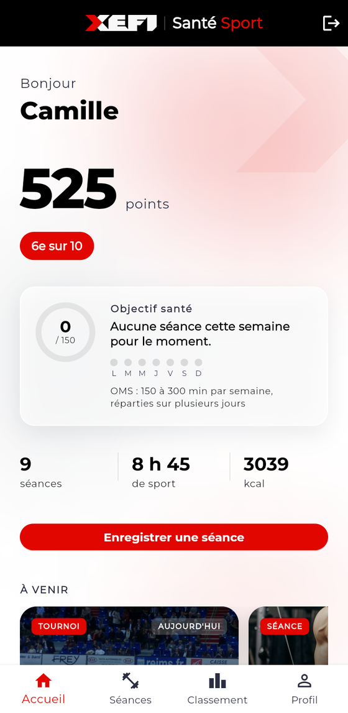
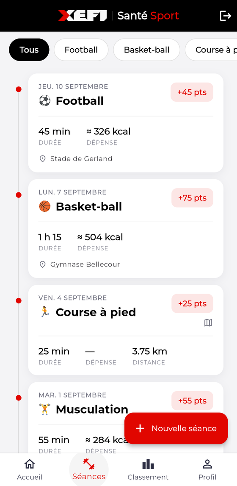
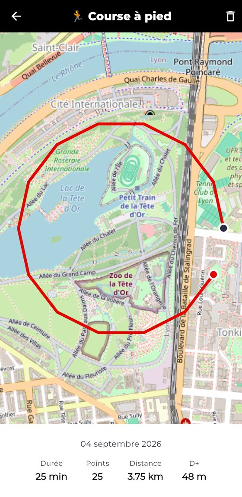
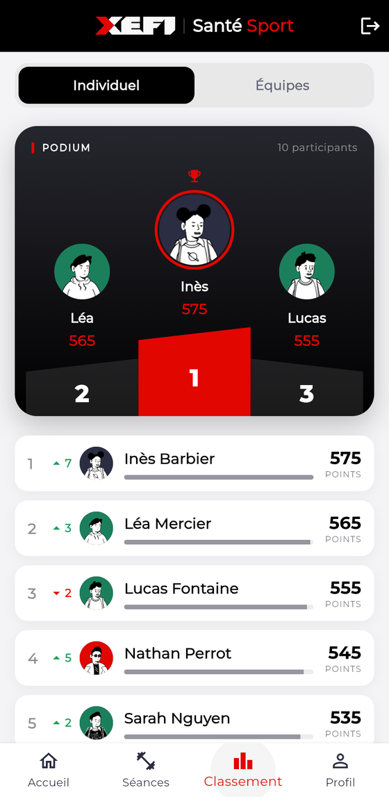
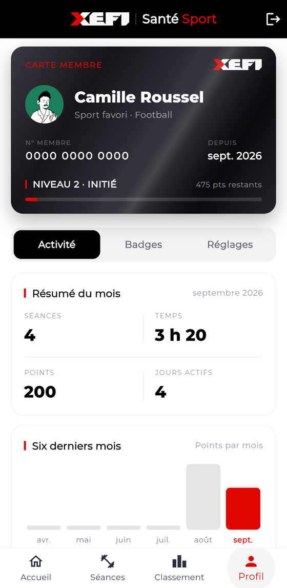
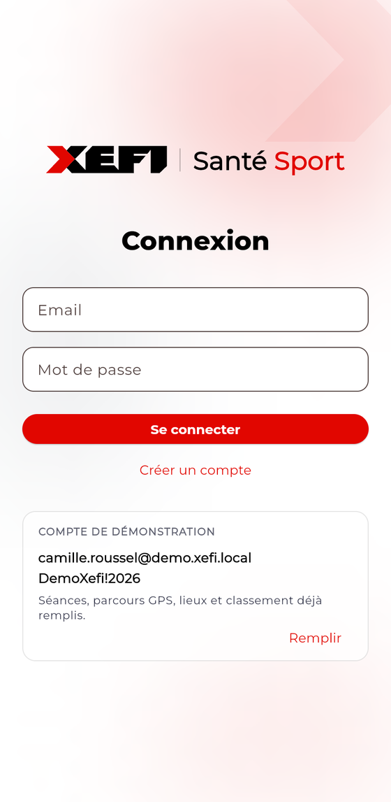

<h1 align="center">XEFI Sport</h1>

<p align="center">
  Le sport en entreprise, suivi comme une compétition — on enregistre ses séances,
  son parcours se dessine sur la carte, et le classement se met à jour.
</p>

<p align="center">
  
  
  
  
</p>

<p align="center">
  <a href="https://github.com/MaximeBlanco/Projet_Xefi_Sante_Sport/releases/latest"><b>Télécharger l'APK</b></a>
  ·
  <a href="#aperçu">Aperçu</a>
  ·
  <a href="#démarrage-rapide">Démarrer en 2 commandes</a>
  ·
  <a href="CAHIER_DES_CHARGES.md">Cahier des charges</a>
</p>

---

## Aperçu

Captures prises sur le jeu de démonstration, avec le compte `camille.roussel`.

<table>
  <tr>
    <td width="33%" align="center">
      
      <br><b>Tableau de bord</b>
      <br><sub>Points, rang, objectif OMS hebdomadaire et prochains événements</sub>
    </td>
    <td width="33%" align="center">
      
      <br><b>Mes séances</b>
      <br><sub>Journal filtrable par sport, avec durée, calories, distance et lieu</sub>
    </td>
    <td width="33%" align="center">
      
      <br><b>Parcours GPS</b>
      <br><sub>Le tracé relevé pendant la séance, distance et dénivelé calculés</sub>
    </td>
  </tr>
  <tr>
    <td width="33%" align="center">
      
      <br><b>Classement</b>
      <br><sub>Podium et classement, en individuel ou par équipe</sub>
    </td>
    <td width="33%" align="center">
      
      <br><b>Profil</b>
      <br><sub>Carte membre, niveau, résumé du mois et six derniers mois</sub>
    </td>
    <td width="33%" align="center">
      
      <br><b>Connexion</b>
      <br><sub>Le compte de démonstration est affiché et se remplit en un clic</sub>
    </td>
  </tr>
</table>

---

## Télécharger

| Je veux… | Lien | Ce qu'il faut installer |
| --- | --- | --- |
| **Juste essayer l'app** | [**Télécharger l'APK Android**](https://github.com/MaximeBlanco/Projet_Xefi_Sante_Sport/releases/latest) | Rien. Un téléphone Android suffit |
| **Lire ou modifier le code** | [**Télécharger le code en .zip**](https://github.com/MaximeBlanco/Projet_Xefi_Sante_Sport/archive/refs/heads/main.zip) | Flutter |
| **Suivre les mises à jour** | `git clone` ci-dessous | Git + Flutter |

```
git clone https://github.com/MaximeBlanco/Projet_Xefi_Sante_Sport.git
cd Projet_Xefi_Sante_Sport
```

Les trois options donnent la même app, connectée à la même base de démonstration
déjà peuplée : il n'y a **aucune clé à demander et aucun compte à créer** pour la
faire tourner. Les identifiants de démo sont plus bas.

### Installer l'APK sur un téléphone Android

Android bloque par défaut les apps qui ne viennent pas du Play Store. Au premier
lancement du fichier `.apk`, le téléphone propose « Autoriser cette source » :
accepter, puis relancer l'installation. L'app est signée avec une clé de debug —
c'est normal pour une démo, et c'est ce qui déclenche l'avertissement.

L'app demande la localisation au premier enregistrement de séance : c'est le
suivi GPS du parcours, décrit plus bas.

## Prérequis

Pour **lancer l'app sur la base partagée**, une seule chose :

- Flutter (SDK `^3.13.3`, voir `pubspec.yaml`)

Pour **la faire tourner sur ta propre base** — développement, ou si tu veux tes
données à toi — il faut en plus :

- Un projet [Supabase](https://supabase.com) (gratuit)
- La [CLI Supabase](https://supabase.com/docs/guides/cli), connectée à ton
  compte : elle applique les migrations **et** déploie l'Edge Function, les
  deux sont nécessaires pour que l'app tourne de bout en bout
- Une clé gratuite [api-ninjas.com](https://api-ninjas.com/api/caloriesburned)
  (compte gratuit, sans carte bancaire) pour le calcul des calories

## Démarrage rapide

Il n'y a rien à configurer. L'app pointe par défaut sur un projet Supabase
partagé, déjà migré et peuplé :

```
flutter pub get
flutter run -d chrome
```

Les identifiants de ce projet vivent dans `lib/core/config/env.dart`. Les
publier est volontaire — une clé `anon` est publique par nature, elle part de
toute façon dans le bundle JavaScript de n'importe quelle app web Supabase, et
ce qui protège les données est le row level security, activé sur chaque table.
La clé `service_role`, elle, n'apparaît nulle part.

### Comptes de démonstration

La base partagée est peuplée par `supabase/seed_demo.sql` : des équipes, des
collègues, leurs séances sur les dernières semaines et un calendrier
d'événements. Tous les comptes ont le même mot de passe, **`DemoXefi!2026`** —
par exemple `camille.roussel@demo.xefi.local` ou `yanis.chevalier@demo.xefi.local`.

Ce sont des personnes inventées, sur un domaine `.local` qui ne peut pas
recevoir de courrier, et leurs portraits sont générés, pas photographiés.

## Configuration — pointer sur ton propre projet Supabase

Pour travailler sur ta propre base plutôt que sur la base partagée, ces deux
valeurs prennent le pas sur les valeurs par défaut :

1. Copie `dart_define.example.json` en `dart_define.json` (déjà ignoré par
   git).
2. Remplis `SUPABASE_URL` et `SUPABASE_ANON_KEY` avec les valeurs de ton
   projet Supabase (Project Settings → API).
3. Lance l'app :

   ```
   flutter pub get
   flutter run --dart-define-from-file=dart_define.json
   ```

Sur un projet Supabase neuf, fais d'abord une fois les trois sections
ci-dessous (base de données, Edge Function, confirmation d'email) : sans
elles il n'y a ni sports à sélectionner, ni calories, ni connexion possible
juste après une inscription.

## Base de données

Le schéma partagé vit dans `supabase/migrations/`. Pour l'appliquer sur ton
projet Supabase :

```
supabase link --project-ref <ton-project-ref>
supabase db push
```

C'est suffisant : la liste fixe des 10 sports (cahier des charges section 3)
est insérée par la migration `20260910120000_v1_rankings_and_calories.sql`
elle-même, avec le nom d'activité anglais (`external_activity_name`) attendu
par l'API de calories. Rien à exécuter à la main après le `db push`.

La migration pose aussi les garde-fous côté serveur, parce que PostgREST
expose les tables directement et qu'une règle qui ne vit que dans le
formulaire Flutter n'en est pas une : `points` est calculé par un trigger (un
client ne peut pas l'envoyer), `duration_min` est plafonné à 1440 minutes et
une séance datée dans le futur est rejetée.

## Edge Function `calculate-calories`

Seul bout de code non-Dart du projet (Deno/TypeScript, dans
`supabase/functions/calculate-calories/`). Elle appelle la Calories Burned
API d'api-ninjas avec une clé stockée en secret Supabase : **la clé ne doit
jamais apparaître dans le code Dart ni dans `dart_define.json`**, seule la
fonction y a accès.

1. Crée un compte gratuit sur [api-ninjas.com](https://api-ninjas.com/api/caloriesburned)
   et récupère ta clé API dans ton profil.
2. Déploie la fonction :

   ```
   supabase functions deploy calculate-calories
   ```

3. Donne-lui la clé (à refaire seulement si la clé change, pas à chaque
   déploiement) :

   ```
   supabase secrets set CALORIES_API_KEY=<ta-cle-api-ninjas>
   ```

Si la fonction n'est pas déployée ou si l'API tombe, enregistrer une séance
marche quand même : l'app bascule sur la formule MET (voir ci-dessous) et
l'historique préfixe la valeur d'un `≈`. Les points (= durée en minutes) et le
classement ne dépendent pas de l'API. Le poids saisi à l'inscription sert au
calcul : un profil sans poids ne déclenche ni l'appel ni l'estimation, et la
séance est alors stockée sans calories (l'historique affiche un tiret).

### Repli local quand l'API ne répond pas

Chaque sport porte son MET (`sports.met`, valeurs du Compendium of Physical
Activities). Dès que l'Edge Function échoue — API en panne, quota épuisé, ou
tout simplement aucune clé configurée — l'app calcule elle-même :

```
kcal = MET x poids_kg x durée_heures
```

La séance stocke alors `calories_estimated = true`, et l'historique affiche
`≈ 368 kcal` au lieu de `368 kcal` : une estimation locale ne doit jamais
passer pour une valeur mesurée. C'est ce qui permet de faire une démo complète
sans clé api-ninjas et sans réseau.

## Développement 100 % local (sans compte Supabase)

Alternative au projet cloud : la CLI Supabase monte toute la stack en
conteneurs Docker sur ta machine. Même schéma, mêmes migrations, aucun compte
à créer. Il faut Docker Desktop démarré.

```
npx supabase@latest start
```

Les migrations de `supabase/migrations/` s'appliquent automatiquement, donc les
10 sports sont là dès le premier démarrage. La commande affiche à la fin
`API_URL` et `PUBLISHABLE_KEY` : reporte-les dans `dart_define.json`, mais
**avec l'hôte `10.0.2.2` au lieu de `127.0.0.1`** — c'est l'alias par lequel
l'émulateur Android joint la machine hôte :

```json
{
  "SUPABASE_URL": "http://10.0.2.2:54321",
  "SUPABASE_ANON_KEY": "<PUBLISHABLE_KEY affichee par supabase start>"
}
```

### Lancer dans le navigateur

L'app tourne aussi en web, ce qui évite de démarrer un émulateur pour montrer
l'interface. Un seul piège : `10.0.2.2` est l'alias de l'émulateur Android et
ne veut rien dire pour un navigateur, qui doit viser `127.0.0.1` directement.
D'où un second fichier de configuration, `dart_define.web.json` (ignoré par git
comme l'autre) :

```json
{
  "SUPABASE_URL": "http://127.0.0.1:54321",
  "SUPABASE_ANON_KEY": "<PUBLISHABLE_KEY affichee par supabase start>"
}
```

```
flutter run -d chrome --web-port=8080 --dart-define-from-file=dart_define.web.json
```

Cette commande ouvre elle-même une fenêtre Chrome, et **fermer cet onglet arrête
le serveur** : `flutter run` considère que l'application s'est terminée. Pour
garder le serveur en vie et ouvrir l'URL dans le navigateur déjà ouvert, vise le
device `web-server` plutôt que `chrome`, puis va sur http://127.0.0.1:8080 :

```
flutter run -d web-server --web-port=8080 --web-hostname=127.0.0.1 --dart-define-from-file=dart_define.web.json
```

Ce qui change par rapport au mobile : le suivi GPS passe par la géolocalisation
du navigateur, donc pas de `adb emu geo fix` — Chrome permet de simuler une
position dans DevTools (Sensors → Location), mais il n'envoie qu'un point fixe,
ce qui ne trace pas de parcours. Pour démontrer le GPS, l'émulateur reste le bon
support ; le web sert à montrer le reste de l'app.

La stack locale sert aussi l'Edge Function. Pour avoir de vraies calories,
copie `supabase/functions/.env.example` en `supabase/functions/.env` (ignoré
par git), colle ta clé api-ninjas dedans, puis redémarre la stack :

```
CALORIES_API_KEY=<ta-cle>
```

```
npx supabase stop && npx supabase start
```

Pour vérifier que l'appel externe aboutit vraiment, sans passer par l'app —
c'est la commande à avoir sous la main en soutenance :

```bash
ANON=$(npx supabase status -o json | grep -o '"ANON_KEY": *"[^"]*"' | cut -d'"' -f4)
curl -s -X POST http://127.0.0.1:54321/functions/v1/calculate-calories \
  -H "Authorization: Bearer $ANON" -H "Content-Type: application/json" \
  -d '{"activity":"cycling","weightKg":75,"durationMin":60}'
```

Une réponse `{"caloriesBurned":...}` prouve que la chaîne complète fonctionne :
app → Edge Function → API externe. Un `{"error":"The calories provider is not
configured."}` signifie que la clé n'est pas lue.

Sans cette clé la fonction répond « not configured », et l'app retombe sur la
formule MET : les séances gardent des calories, simplement préfixées d'un `≈`.
Rien n'est bloqué.

Commandes utiles : `npx supabase status` (URL et clés), `npx supabase stop`
(arrêt, les données sont conservées), `npx supabase db reset` (rejoue les
migrations sur une base vide). Le Studio est sur http://127.0.0.1:54323.

À savoir : la stack locale parle en HTTP simple, qu'Android bloque depuis
l'API 28. `android/app/src/debug/res/xml/network_security_config.xml` lève
l'interdiction pour les seuls hôtes de loopback, et uniquement en build debug —
la release reste sans cleartext.

## Suivi GPS du parcours

Sur un sport marqué `is_gps_trackable`, le formulaire propose « Suivre le
parcours en direct » : l'app enregistre les positions, trace le parcours sur la
carte, et à l'arrêt renvoie la durée, la distance et le dénivelé au formulaire.
Les points bruts sont stockés dans `sessions.route` (jsonb), et l'historique
affiche la carte au détail d'une séance.

Les fonds de carte viennent d'**OpenStreetMap** via `flutter_map` : aucune clé,
aucun compte de facturation, contrairement à Google Maps.

Deux choix qui méritent une explication :

- **Distance et dénivelé sont recalculés depuis les points**, jamais lus depuis
  la vitesse ou l'odomètre du téléphone, qui dérivent. Un seuil ignore le bruit
  GPS (5 m à l'horizontale, 3 m à la verticale) : sans lui, un téléphone posé
  sur une table invente des centaines de mètres.
- **Android lit le GPS via `LocationManager`**, pas via le fused provider de
  Play Services (`forceLocationManager: true`). Fused est meilleur en intérieur,
  mais cette fonctionnalité ne sert qu'en extérieur, où fused retombe de toute
  façon sur le GPS brut — et surtout, le fused provider de l'émulateur ignore
  `adb emu geo fix`, ce qui rendrait toute démo impossible.

### Simuler un parcours dans l'émulateur

L'émulateur ne bouge pas, mais on peut lui envoyer des positions. Démarre le
suivi dans l'app, puis envoie une suite de points espacés de plus de 5 m :

```powershell
$adb = "$env:LOCALAPPDATA\Android\Sdk\platform-tools\adb.exe"
$lat = 45.7500; $lng = 4.8500
for ($i = 0; $i -lt 20; $i++) {
  $lat += 0.00025; $lng += 0.00008
  & $adb emu geo fix $lng.ToString("F6") $lat.ToString("F6") 170
  Start-Sleep -Milliseconds 700
}
```

À savoir : l'émulateur impose sa propre altitude et ignore celle passée à
`geo fix`, donc le dénivelé reste à 0 en simulation. Le calcul lui-même est
couvert par `test/core/route_metrics_test.dart`.

## Lieux de séance (OpenStreetMap / Overpass)

Le formulaire propose d'attacher un lieu à une séance : salle, complexe,
gymnase, stade, terrain, piste, piscine ou parc. La liste vient de l'**API
Overpass**, qui interroge les données OpenStreetMap — les mêmes que les fonds de
carte déjà affichés. Aucune clé, aucun compte, contrairement à Google Places.

C'est la deuxième API externe du projet, après celle des calories.

Le lieu reste facultatif, et un champ libre permet de saisir un endroit
qu'OpenStreetMap ne connaît pas. En base, `venue_osm_id` à `null` signifie
exactement cela : saisi à la main. Pas de booléen en plus.

Deux points qui méritent une explication :

- **Overpass est un service public sous usage équitable.** La requête porte son
  propre délai maximum, plafonne le nombre de résultats et cherche dans un rayon
  fixe. La liste est lue une fois par ouverture du sélecteur, jamais à chaque
  reconstruction de l'écran.
- **Le vocabulaire d'OSM n'est pas le nôtre.** `VenueKind` traduit les tags
  (`leisure`, `building`, `sport`) vers les catégories de l'app. Un changement de
  convention chez OSM se corrige à cet endroit-là seulement, sans toucher ni la
  base ni les écrans.

Dans l'émulateur, la recherche se fait autour de la position simulée :

```powershell
$adb = "$env:LOCALAPPDATA\Android\Sdk\platform-tools\adb.exe"
& $adb emu geo fix 4.8320 45.7578 170   # Lyon Bellecour
```

## Auth en développement

Supabase demande une confirmation d'email par défaut : juste après une
inscription, la connexion échoue avec `Email not confirmed` tant que le lien
reçu par mail n'a pas été cliqué. Pour développer sans friction, désactive
**Confirm email** dans le dashboard Supabase :
Authentication → Sign In / Providers → Email. À réactiver avant toute mise en
production.

## Ce qui marche en V1

Miroir de la definition of done (cahier des charges, section 6) :

- Créer un compte (email, mot de passe, nom, poids) et se connecter.
- Enregistrer une séance : sport de la liste fixe, durée réglée sur deux
  molettes heures/minutes (la base ne stocke que des minutes), date
  (les dates futures sont refusées).
- Calories réelles issues de la Calories Burned API via l'Edge Function,
  stockées avec la séance, avec repli sur la formule MET (préfixe `≈`) quand
  l'API ne répond pas.
- Suivi GPS du parcours pour les sports marqués `is_gps_trackable` (course,
  vélo, marche) : tracé en direct sur une carte, distance et dénivelé calculés,
  durée pré-remplie à l'arrêt. Voir ci-dessous.
- Historique personnel des séances, de la plus récente à la plus ancienne, avec
  la carte du parcours au détail d'une séance qui en a un.
- Classement global par points décroissants (`points = duration_min`, calculé
  côté base), avec le rang de l'utilisateur connecté mis en avant.
- Charte XEFI respectée : couleurs et Montserrat centralisés dans
  `lib/core/theme`.
- `flutter analyze` et `flutter test` passent sans erreur.

Hors périmètre V1 (section 7) : suivi GPS, catalogue de sports wger, contacts,
équipes, classements par sport, badges.

## Qualité

Avant toute PR :

```
flutter analyze
flutter test
```
